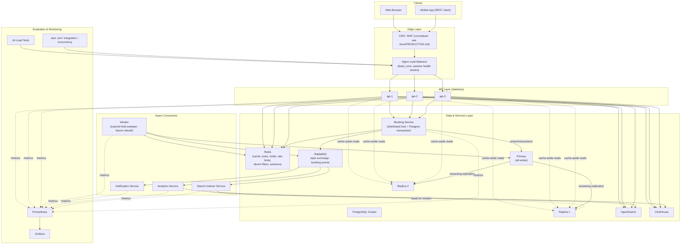

# Architecture

This document describes the "Distributed Event Booking Architecture (Enhanced)" as actually implemented in this repository.

## Layers

```
Clients (Browser, Mobile-capable REST API)
   |
Edge Layer (Nginx + in-request Bloom Filter checks)
   |
API Layer (api-1, api-2, api-3 - stateless)
   |
Data & Services Layer (Redis, Booking Service, RabbitMQ, Postgres Cluster, OpenSearch, ClickHouse)
   |
Evaluation & Monitoring (k6, Jest, Prometheus, Grafana)
```

## Mermaid diagram



## Why each piece is there

| Component | Purpose | Code |
|---|---|---|
| Nginx | Load balances across stateless API instances, least_conn + passive health checks | `infrastructure/nginx/nginx.conf` |
| Bloom Filter | Rejects definitely-nonexistent usernames/events/bookings/seats before a DB round trip | `packages/redis/src/bloomFilter.ts` |
| API-1/2/3 | Stateless HTTP layer: auth, events, seats, search/analytics proxy, SSE | `apps/api` |
| Redis | Cache-aside, distributed locks, seat holds, rate limiting, sessions, bloom filter bitsets | `packages/redis` |
| Booking Service | The only writer of booking state; owns the lock + transaction + idempotency logic | `apps/booking-service` |
| RabbitMQ | Topic exchange decoupling booking confirmation from notification/analytics/search | `packages/messaging` |
| PostgreSQL Cluster | Source of truth; primary for writes, replicas for reads, real streaming replication | `infrastructure/postgres` |
| Worker | Sweeps expired seat holds back to AVAILABLE; rebuilds bloom filters on boot | `apps/worker` |
| OpenSearch | Full text + filtered event search, eventually consistent | `services/search-service` |
| ClickHouse | OLAP analytics off the booking critical path | `services/analytics-service` |
| Prometheus/Grafana | Metrics scraping + dashboards | `infrastructure/prometheus`, `infrastructure/grafana` |

See `docs/DISTRIBUTED_SYSTEMS.md` for the consistency/locking/replication explanation and `docs/ARCHITECTURE_AUDIT.md` for the full per-component audit table required by the project brief.
