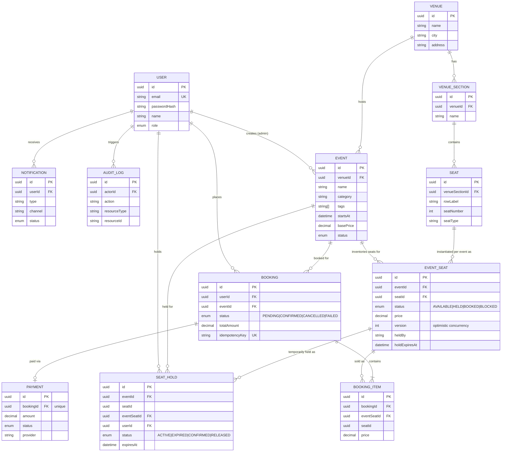

# Entity-Relationship Diagram

Source of truth: `packages/database/prisma/schema.prisma`.

## Why `event_seats` exists separately from `seats`

A physical `Seat` (e.g. "Floor Row A Seat 1") is booked independently for every `Event` held at that venue. `EventSeat` is the per-event inventory row that actually carries `status`, `price`, and the optimistic-concurrency `version` column - `Seat` itself never changes once a venue is configured. This is what makes "Seat A1 is AVAILABLE for Concert-1 but BOOKED for Concert-2" representable at all.
